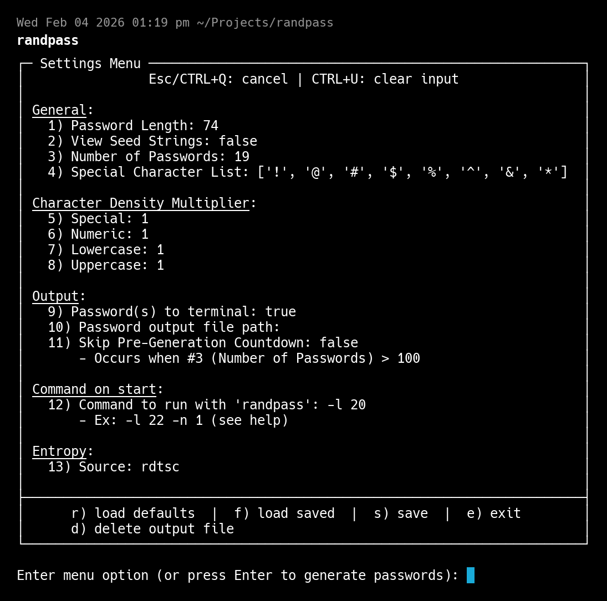

# randpass

[](https://github.com/BrandonLeeDotDev/randpass/releases/latest)
[](LICENSE-MIT)

Generates passwords. One, a million, or a continuous byte stream.

**[Installation](#installation)** | **[Examples](#examples)** | **[Interactive Mode](#interactive-mode)** | **[Technical Details](#technical-details)**

## Examples

```bash
# Basic
randpass                                 # Interactive TUI
randpass -l 20                           # 20-character password
randpass -l 16 -b                        # Copy to clipboard

# Character sets
randpass -l 32 --hex                     # Hex only (0-9, a-f)
randpass -l 20 --no-special              # Alphanumeric only
randpass -l 20 --special '_-'            # Custom special characters

# Bulk
randpass -l 32 -n 1000000 -o out.txt     # Million passwords, progress bar, interruptible
randpass -l 24 -n 1000 -o passwords.txt

# Raw bytes
randpass --bytes -n 1G -o random.bin     # 1GB to file
randpass --bytes -n 100M | xxd | head    # 100MB to stdout
randpass --bytes | dieharder -a -g 200   # Infinite stream for testing

# Command mode (save defaults)
randpass -c -l 20 -n 5                   # Future `randpass` runs use these flags
randpass -c                              # Clear saved defaults
```

Run `randpass -h` for all options.

## Interactive Mode

Run without arguments for the TUI.



| # | Setting | Description |
|---|---------|-------------|
| 1 | Password Length | Characters per password |
| 2 | View Seed Strings | Show the character pool before/after shuffle |
| 3 | Number of Passwords | How many to generate per run |
| 4 | Special Character List | Which symbols to include |
| 5-8 | Density Multipliers | Weight character classes. Setting lowercase to 2 adds a-z twice to the pool, making them 2× more likely |
| 9 | To terminal | Print passwords to stdout |
| 10 | Output file path | Write passwords to file. Defaults to `rand_pass.txt` if path ends with `/` or `.` |
| 11 | Skip Countdown | Bypass 10s delay before large batches (>100) |
| 12 | Command on start | Default flags for `randpass` (see Command Mode) |
| 13 | Entropy Source | `rdtsc` (hardware) or `/dev/urandom` |

Settings persist to `~/.config/randpass/settings`.

---

## Installation

### Pre-built Packages

Download from [GitHub Releases](https://github.com/BrandonLeeDotDev/randpass/releases/latest):

| Platform | Package |
|----------|---------|
| Debian/Ubuntu | `randpass_x.x.x_amd64.deb` |
| Fedora/RHEL | `randpass-x.x.x-1.x86_64.rpm` |
| Arch Linux | `PKGBUILD` |
| Linux (generic) | `randpass-vx.x.x-x86_64-linux.tar.gz` |
| AppImage | `randpass-vx.x.x-x86_64.AppImage` |

```bash
# Debian/Ubuntu
sudo dpkg -i randpass_*.deb

# Fedora/RHEL
sudo rpm -i randpass-*.rpm

# Arch Linux
makepkg -si

# Generic (extract and copy)
tar xzf randpass-*.tar.gz
cp randpass-*/randpass ~/.local/bin/
```

### Build from Source

```bash
cargo build --release
cp target/release/randpass ~/.local/bin/
```

---

## Technical Details

### PRNG

Uses CPU timestamp counters (`rdtsc` on x86_64, `cntvct_el0` on ARM) mixed with a 10,000-prime table and SplitMix64 finalizer. With `-u`, uses a 32MB `/dev/urandom` pool with background refresh instead.

```
Entropy Source → rotate(17) × prime[idx] ⊕ entropy → SplitMix64 → Output
```

### Password Generation

Character pool built from enabled classes with configurable density multipliers (e.g., `lowercase_density: 2` makes lowercase 2× more likely). Pool is shuffled, then characters selected via PRNG indices.

### Security

- Passwords zeroized after use
- Direct `write_all()` I/O avoids format string allocations
- Terminal state restored on signals
- Settings file stores configuration only, never passwords
- Pipe-safe: escape codes suppressed when stdout is not a TTY

### Validation

| Suite | Tests | HW (rdtsc) | urandom |
|-------|-------|------------|---------|
| TestU01 BigCrush | 160 | 159 pass, 1 weak | 158 pass, 2 weak |
| Dieharder | 114 | 112 pass, 2 weak | 112 pass, 2 weak |

Full results in [`rng/results/`](rng/results/).

### Platforms

| Arch | Hardware Source |
|------|-----------------|
| x86_64 | `rdtsc` |
| aarch64 | `cntvct_el0` |
| arm | `pmccntr64` |
| Other | `/dev/urandom` fallback |

## License

MIT OR Apache-2.0
